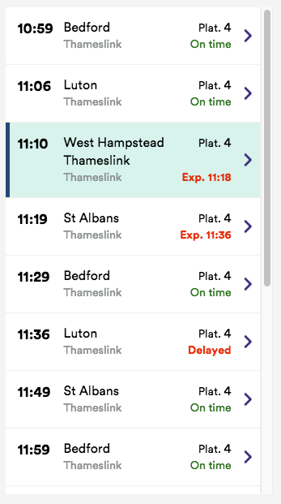
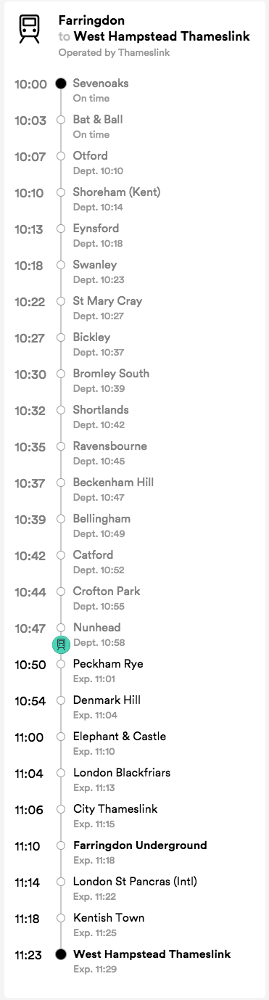

# JavaScript Front-end Developer Test - Perm

[](https://github.com/prettier/prettier)

### Approach

- This was my first time working with React.js so I needed to research it before I could begin working on this app.
- I put some time in getting the routes working with BrowserRouter, but that took too long, so when I found hashRouter, I used it! The thing is that you see a hash in the url, if I had more time I would like to do the routing in a different way.
- Lay-out the basic front-end to make sure the basic styling and elements are in place.
- Research in `styled-components` and applied it to the app

### Instructions

- Clone this repository
- Run `npm install` to install the dependencies
- Run `npm start` and go to localhost:3000 in your browser
- To see tests run `npm test`

### Technologies Used:

- React.js
- React Router Dom for routing
- Styled Components and Fontawesom for styling
- Jest for testing

### User Stories

```
As a User
So I can see which trains depart from London Waterloo
I would like to have them on one page
```

```
As a User
So I know what time the trains leave
I would like to see the departure time
```

```
As a User
So I can see which platform trains depart from
I would like see the departure platforms
```

```
As a User
So I can see if the trains are not delayed,
I would like to see if they are on time
```

```
As a User
So I can see where one service stops,
I would like to see all the stops of a service
```

```
As a User
So I can see where one service stops,
I would like to see all the stops of a service
```

### Still to do

- Make one service using different data.json files
- Get rid of duplication
- More research on Jest and testing React
- better styling
- getting rid of the hash in the url

## Problem description

We want to create a simple two "page" web application to display train services.
Our UX designer has created some mockups:

1.  On the first page there is a list of all departing services, like this:



2.  When user clicks/taps on a service, calling points are displayed:



## Implementation details:

Create a React application with those two pages.
Use the following data:

- List of departing services: wat-departures.json
- Click on first service: WAT-service-origin-W92931-2018-04-24.json
- Click on second service: WAT-service-origin-W92443-2018-04-24.json

These files include origins and destinations as codes, get your app working but just displaying these codes.
We have estimated the test to take a few hours, but feel free to use more time if you need it.
Feel free to make tradeoffs or simplify things.

**Nice to have:**

- Is it a responsive app?
- CSS-only solution (no images)
- Routing

**We will pay attention to:**

- Code quality
- Readme: have you made any trade-offs? What do you
- Naming conventions
- Consistency
- Styling
- Tests quality
- Commit history
